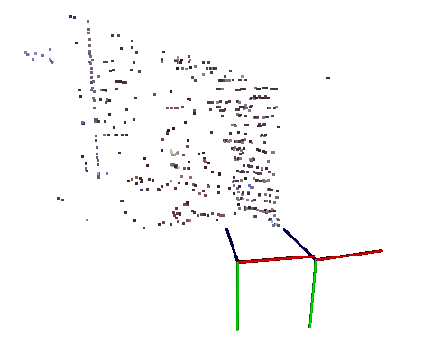
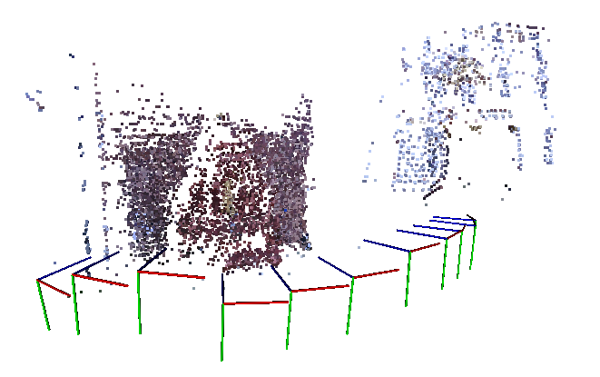

# sfm_learn
一个基于opencv的SFM简单实现，学习用途。欢迎光临[我的主页](https://sites.google.com/view/pidan1231239/home)查看更多其他项目详情。

# 问题简化
* 假设图像有序
* 直接用前两帧做初始化，解2D-2D，三角化建立初始全局地图
* 之后每帧与全局地图中上一帧范围内的点匹配，解3D-2D，三角化后向全局地图添加新点
* 最后对全局地图进行BA

# 完成进度

以下示例采用数据[fountain-P11](http://icwww.epfl.ch/multiview/denseMVS.html)。其11张照片位于datasets/fountain_dense_images目录下。
1. 前两帧做2D-2D初始化：

2. 之后每帧与全局地图中上一帧范围内的点匹配，解3D-2D，三角化后向全局地图添加新点：

计划：
1.  完成SFM的BA代码
2.  改进匹配点、地图点筛选方法
3.  每次解3D-2D后，做一次局部BA优化
4.  学习SLAM的实现，开始向SLAM转化

# 实现

> 本实现的类设计参考了《视觉SLAM十四讲：从理论到实践》第9讲中对一个深度相机视觉里程计的实现。

## 类设计

* Camera：相机-世界-像素坐标转换，相机参数
* Frame：判断点是否在视野内，图像、位姿、相机
* MapPoint：路标点，描述子、所在帧
* Map：地图，存储路标、帧
* SFM：顺序读取输入的路径，完成简化小节描述的步骤

## 问题

* opencv:
    * 找不到/usr/local/include/opencv2/viz.hpp：
        * 原因是编译opencv前没有安装vtk
        * [ubuntu安装OPENCV的VIZ模块](https://blog.csdn.net/j_____j/article/details/78788155)
    * int flag如何快速找到？
    * [cmake: how to build opencv in both debug and release mode?](https://stackoverflow.com/questions/29634489/cmake-how-to-build-opencv-in-both-debug-and-release-mode)
    * 在一个函数中通过at<uin8_t>()对一个局部变量Mat循环赋值后，报错corrupted double-linked list或mat opencv invalid next size或return 11
        * 原来是因为越界写入，at<>()没有越界判断

# 改进

* 筛选匹配点
    * 以最短描述子距离的倍数为阈值选择最匹配的描述点：slambook ch7 2d2d
    * 用FLANN或KNN做特征点匹配：Trying to match two images using sift in OpenCv, but too many matches
    * 参考opencv官方教程做特征点匹配：Feature Matching
    * Ratio Test方法：OpenCV实现SfM（二）：双目三维重建
* 对每次添加帧解3D-2D后，做一次优化
* 建立全局和局部地图，局部地图用于匹配，减少匹配时间

# 参考资料

## SLAM

* [ORB-SLAM](http://webdiis.unizar.es/~raulmur/orbslam/)：
    > ORB-SLAM is a versatile and accurate SLAM solution for Monocular, Stereo and RGB-D cameras.
    * [github](https://github.com/raulmur/ORB_SLAM)
    * [ORB-SLAM（一）简介](http://www.cnblogs.com/luyb/p/5215168.html)：系例中文介绍
    * [ORB-SLAM2源码详解 by 吴博](http://rosclub.cn/post-505.html)：原理、流程、结构
    * [ORB-SLAM代码详解之SLAM系统初始化](https://blog.csdn.net/c602273091/article/details/54933760)：系列代码详解
    教程：
    *   [SLAM Course - WS13/14](https://www.youtube.com/playlist?list=PLgnQpQtFTOGQrZ4O5QzbIHgl3b1JHimN_)
*   [SLAM Course - WS13/14](https://www.youtube.com/playlist?list=PLgnQpQtFTOGQrZ4O5QzbIHgl3b1JHimN_)

## SFM

* [Structure from Motion Using OpenCV](https://blog.csdn.net/zkl99999/article/details/46467277)：不同的特征点匹配方法、用[SSBA](https://github.com/chzach/SSBA/tree/master/SSBA-4.0)做BA、调用PCL的API处理和显示点云
    * [三维重建-opencv实现sfm](https://blog.csdn.net/qq_26499769/article/details/51817254)：转载，完整单篇实现，不含公式，用ceres做BA，代码需积分，文章中代码不完整
    * [OpenCV实现SfM（一）：相机模型](https://blog.csdn.net/AIchipmunk/article/details/48132109)
    * [OpenCV实现SfM（二）：双目三维重建](https://blog.csdn.net/AIchipmunk/article/details/48157369)
    * [OpenCV实现SfM（三）：多目三维重建](https://blog.csdn.net/aichipmunk/article/details/51232861)
    * [OpenCV实现SfM（四）：Bundle Adjustment](https://blog.csdn.net/aichipmunk/article/details/52433884)

* 参考实现：
    * [Structure From Motion](https://docs.opencv.org/3.1.0/de/d7c/tutorial_table_of_content_sfm.html)：opencv sfm模块官方教程 
    * [Structure-from-Motion Toy Lib Upgrades to OpenCV 3](http://www.morethantechnical.com/2016/10/17/structure-from-motion-toy-lib-upgrades-to-opencv-3/)：[github](https://github.com/royshil/SfM-Toy-Library/)，完整的入门代码，使用Boost
    * [Structure from motion（SFM）原理 - 附我的实现结果](https://blog.csdn.net/Mahabharata_/article/details/70799695)：只有结果
    * [SFM WITH OPENCV + GTSAM + PMVS](http://nghiaho.com/?p=2379)
    * cashiwamochi/[simple_triangulation.cc](https://gist.github.com/cashiwamochi/8ac3f8bab9bf00e247a01f63075fedeb)

## [视觉SLAM十四讲：从理论到实践](http://www.broadview.com.cn/book/4938)

> 依赖库：

*   [eigen](http://eigen.tuxfamily.org/index.php?title=Main_Page)：a C++ template library for linear algebra: matrices, vectors, numerical solvers, and related algorithms.
    *   问题：
        *   第13讲例程将Eigen::Isometry3d存储到vector中时运行时报错：[Explanation of the assertion on unaligned arrays](http://eigen.tuxfamily.org/dox-devel/group__TopicUnalignedArrayAssert.html)、[运行PLSLAM时，遇到Eigen对齐问题](https://blog.csdn.net/wojiushixiangshi/article/details/78356271)
*   [Sophus](https://github.com/strasdat/Sophus)：C++ implementation of Lie Groups using Eigen.
*   [pcl](http://pointclouds.org/)：The Point Cloud Library (or PCL) is a large scale, open project [1] for 2D/3D image and point cloud processing.
    *   安装：
        *   [Downloads](http://pointclouds.org/downloads/)
        *   [Ubuntu安装PCL(Point Cloud Library)](https://blog.csdn.net/xs1102/article/details/74736298)：apt安装改用apt install libpcl-dev 
        *   [Compiling PCL from source on POSIX compliant systems](http://www.pointclouds.org/documentation/tutorials/compiling_pcl_posix.php)：编译安装
    *   问题：
        *   通过apt install libpcl-dev安装的pcl在链接时遇到错误：[Link error: cannot find vtkproj4](https://github.com/PointCloudLibrary/pcl/issues/1594)
*   [Ceres](https://github.com/ceres-solver/ceres-solver)：A large scale non-linear optimization library.
    *   [Ceres Solver](http://ceres-solver.org/)：文档
    *   [在Ubuntu16.04下安装Ceres](https://blog.csdn.net/jz1570551401/article/details/78207208)：cmake环节报错，可能缺少库
    *   [ubuntu16.04下编译ceres-solver](https://www.cnblogs.com/dakewei/p/8421763.html)：包括上面缺少的库
*   [g2o](https://github.com/RainerKuemmerle/g2o)：A General Framework for Graph Optimization.
    *   [文档](https://github.com/RainerKuemmerle/g2o/blob/master/doc/g2o.pdf)(file://C:\Users\85057\Evernote\TEMP\enhtmlclip\g2o.pdf)
    *   [openslam/g2o](https://openslam-org.github.io/g2o.html)：官网
    *   书中用到的g2o版本采用普通指针，最新版本已更改为stl的智能指针，直接使用会报错
*   [DBow3](https://github.com/rmsalinas/DBow3)：an open source C++ library for indexing and converting images into a bag-of-word representation.
*   [octomap](https://octomap.github.io/)：An Efficient Probabilistic 3D Mapping Framework Based on Octrees
    *   问题：
        *   [Octovis在Ubuntu16.04下运行出现core dump的解决方案](http://www.cnblogs.com/hitlrk/p/6667253.html)

